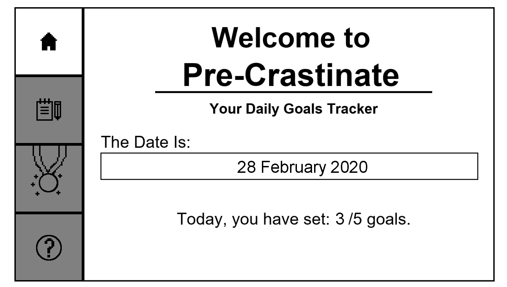
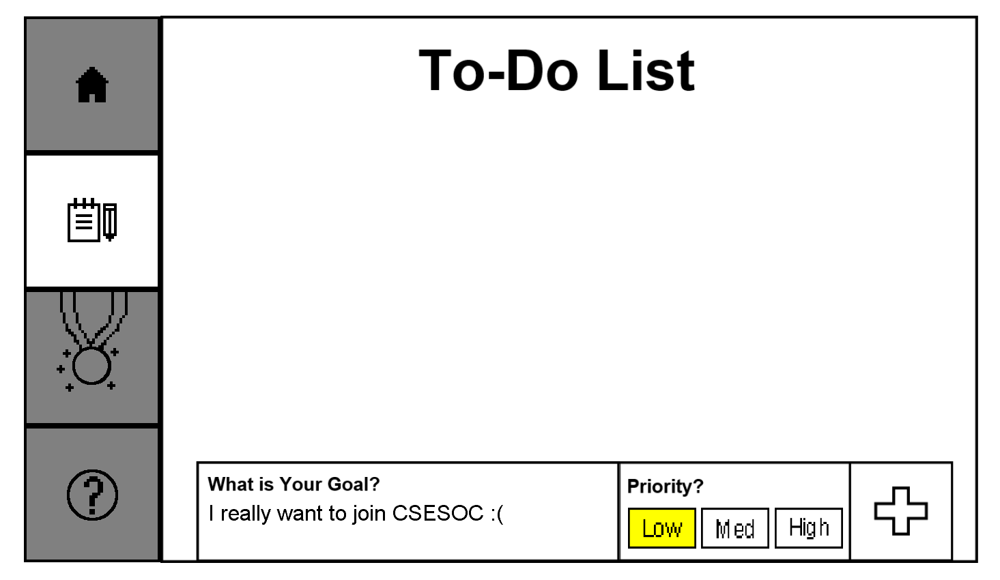
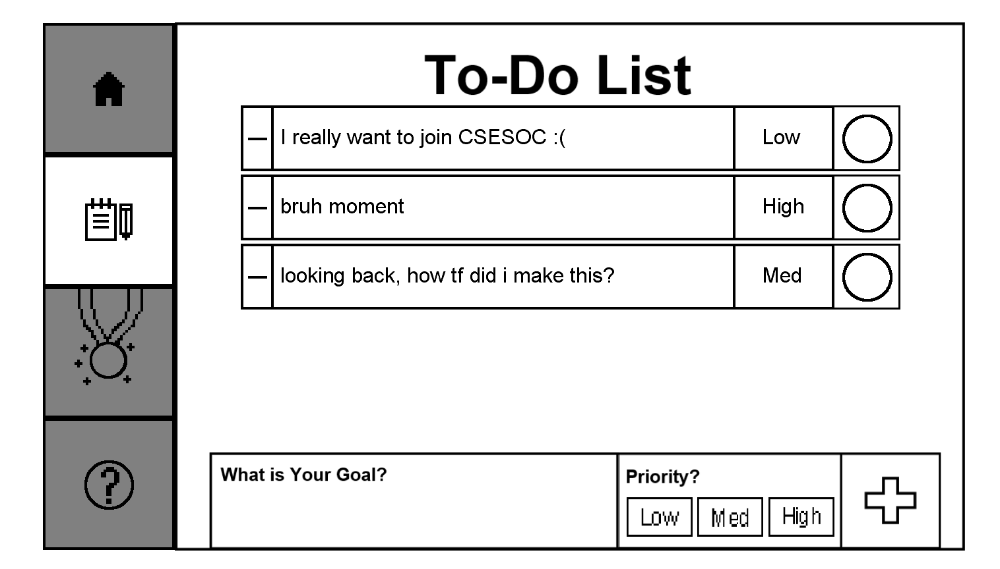
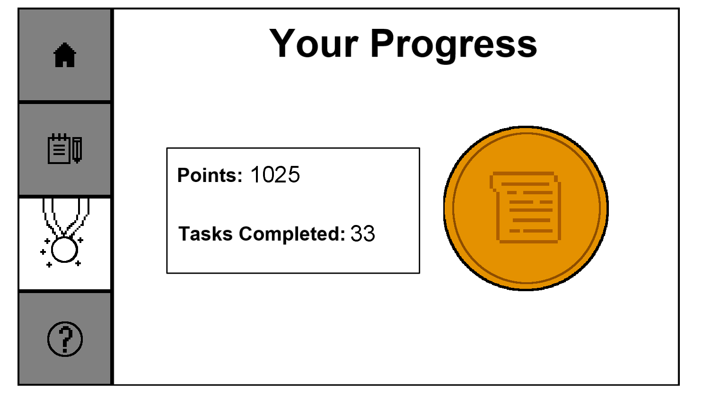
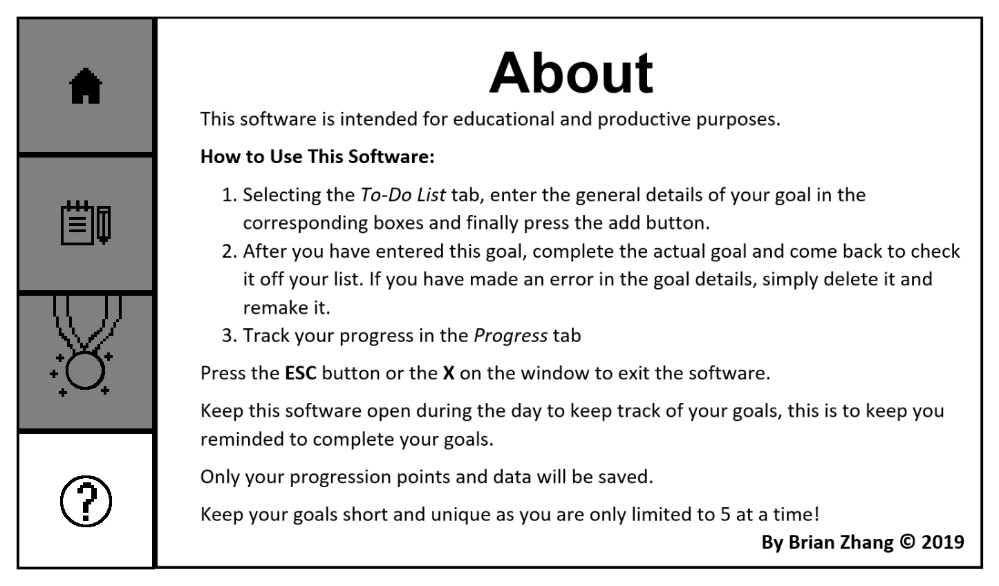

# To-Do-List-Software

A fully functional to-do list software where users can add tasks, tick them off and have the data saved and reviewed as well as rewarded by in-app badges. All sprites were made by myself in Aseprite. 

This software was programmed with XNA/C# in Monogame. In order to run this project, you must have Monogame installed (as long as you can run a new template with blue default screen, you can run this).

Make sure the directories are not changed or else sprites and the save function will not work. I blame my lack of time, but one issue with the save is that you need to get a direct file path to actually enable the save feature. This means you need to rewrite the save path when you want to run the code from a different file path to how you ran it previously. So please change that to fix it.

